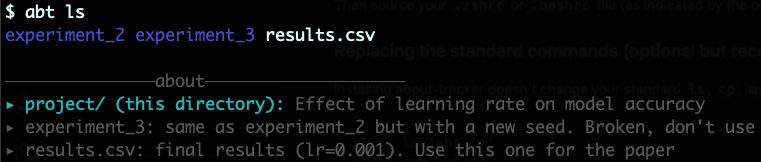

# about-tracker
Tool to add and manage metadata for files and directories.

## Setup

Run the following commands in terminal:

```sh
git clone https://github.com/shashkat/about-tracker.git
cd about-tracker
./install.sh
```

Then source your `.zshrc` or `.bashrc` file (as indicated by the output once you have installed successfully) to activate `about-tracker` in your current shell session.

## Getting started

All about-tracker commands are run through `abt`: `abt ls`, `abt cp`, `abt mv`, `abt rm` and `abt modify`. Run `abt help` to see the list.

Now you can go to any directory and for any file or directory in that location, add a metadata file using:
`abt modify file.txt` or `abt modify directory`.
You can also add a metadata for the current directory you are in using `abt modify .`. 
If the metadata file is already existing for the entity, the text editor will open letting you edit the existing file.

Now, whenever you run `abt ls` from any directory, if there are any metadata files of entities inside that directory, or of the current directory (which would be located in the parent folder), they will also be shown in the output:

<!--  -->
 <br>


Whenver you copy or move a file/directory using `abt cp` or `abt mv`, its metadata file if existing will be copied appropriately automatically. If you try to remove a file/directory using `abt rm` whose metadata file already exists, then you will get warning about the removal of the assisting metadata file too, and you have to confirm that action.

**NOTE: Its very important that the user doesn't move/copy the files through something other than the `abt` commands. Because then, the metadata files won't move along with the file.**

### Replacing the standard commands (optional)

Installing about-tracker doesn't change your standard `ls`, `cp`, `mv` and `rm` commands. If you want those commands to always use about-tracker, add the following aliases to your `.zshrc` or `.bashrc` file:

```sh
alias ls='abt ls'
alias cp='abt cp'
alias mv='abt mv'
alias rm='abt rm'
```

You can still run the original command at any time using `command`, for example `command ls`.


